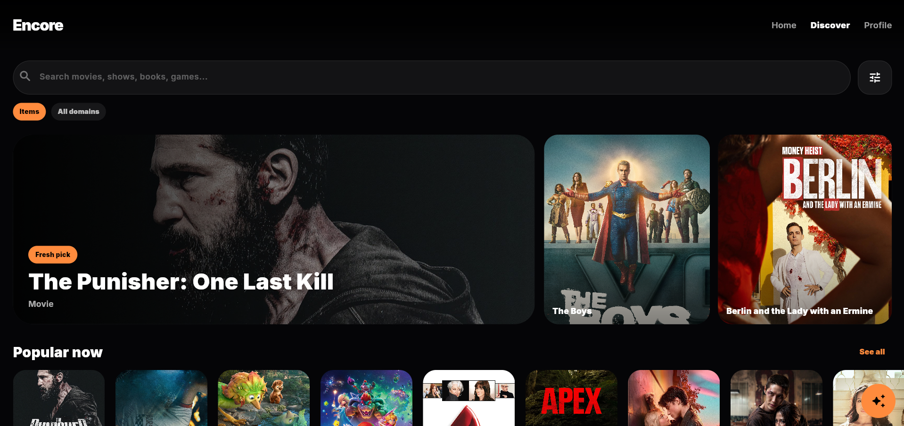
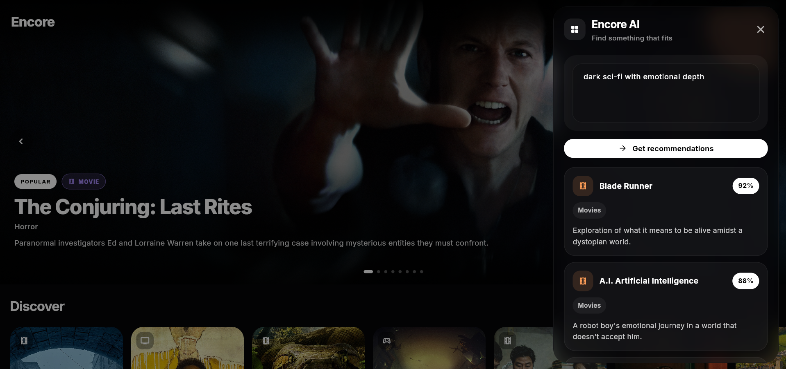
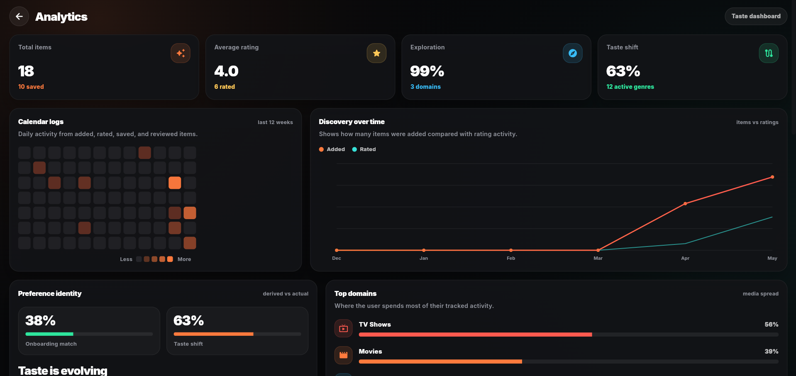
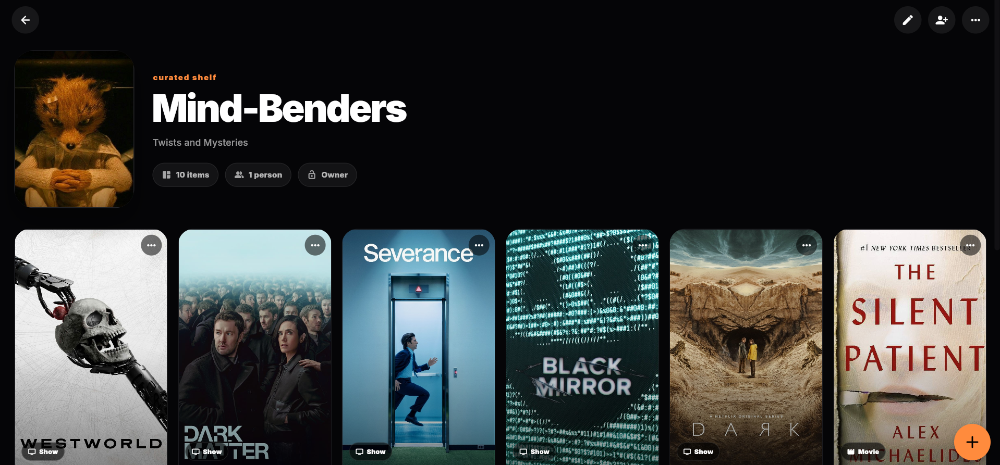
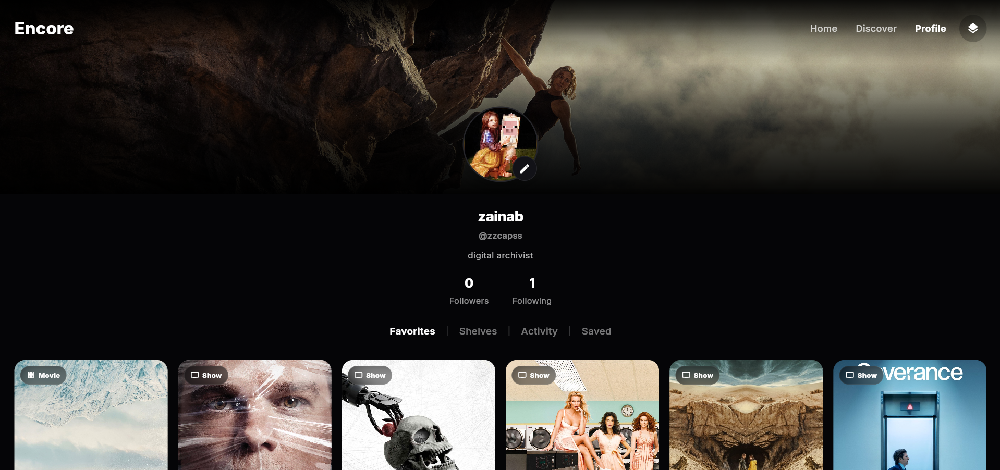

# Encore

*Bachelor Thesis Project – Bahrain Polytechnic (2026)*

A cross-domain media tracking and discovery platform that brings together movies, TV shows, books, and games within a single intelligent ecosystem.

Encore combines personalized recommendations, conversational AI, social discovery, and analytics to help users discover new content, track their interests, and explore how their preferences evolve over time.

## Features

- Cross-domain discovery across Movies, TV Shows, Books, and Games
- AI-powered conversational recommendation assistant
- Personalized recommendations based on user interactions
- Reviews, ratings, favorites, and status tracking
- Social activity feeds and public user profiles
- Collaborative shelves
- Discovery source tracking
- Preference and engagement analytics

## AI-Powered Recommendations

Encore includes a conversational AI recommendation assistant that allows users to describe exactly what they are looking for using natural language.

Instead of relying only on historical interaction data, users can request recommendations based on moods, themes, genres, characters, experiences, or specific preferences. The AI then generates personalized suggestions across all supported media domains through one unified interface.

Powered by Groq and LLaMA 3.1.

## Screenshots

### Home

### Discover

### AI Recommendations

### Analytics

### Shelves

### Profile

## Technology Stack

## AI Recommendation Engine

Encore uses a dedicated AI backend server to power conversational recommendations across movies, TV shows, books, and games.

🔗 AI Server Repository:
https://github.com/zainnalthamer/Encore-AI-Server

The AI recommendation engine is built with Node.js and integrates Groq's high-speed inference platform with Meta's LLaMA 3.1 model to generate context-aware recommendations from natural language prompts.

## Research Findings

Testing demonstrated that content discovery is influenced by a combination of algorithmic recommendations, social influence, and AI-assisted exploration.

Results showed that:

- Traditional recommendation systems primarily reinforced existing preferences and familiar content.
- Social discovery exposed users to content they would not have otherwise encountered.
- AI-assisted recommendations encouraged more intentional exploration through natural language interaction.
- Cross-domain discovery helped users engage with content beyond their usual media preferences.

## Getting Started

### Prerequisites
- Flutter SDK
- Firebase Project
- Cloudinary Account
- TMDB API Key
- RAWG API Key
- Groq API Key

### Installation

git clone <repository-url>
cd encore
flutter pub get

Create a `.env` file and configure the required API keys and environment variables.

Run the application:

flutter run

## Future Work

- Adaptive recommendation models that continuously evolve alongside changing user preferences.
- Explainable recommendations that show why specific content was suggested and which factors influenced the recommendation.
- Long-term preference evolution analysis to visualize how interests change over months or years.
- Community-driven recommendation signals that combine social influence, AI reasoning, and interaction history.
- Expanded support for additional media domains such as music, podcasts, comics, and anime.